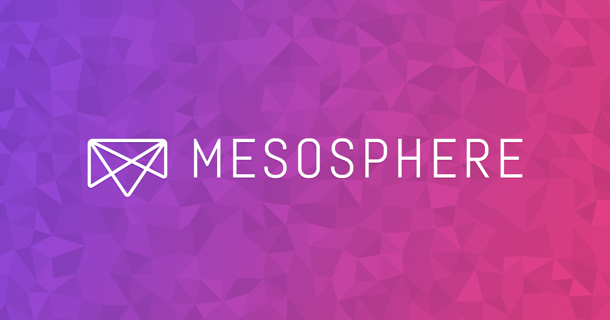

# Mesosphere Hack Day @ Gophercon 2015

Welcome to the Mesosphere Hack Day @ Gophercon 2015! This hack day is
designed so that you can join at any time during the day. There are
two tracks we have prepared for you.

## Mesos framework development

In this track you'll learn how to write a Mesos framework in Go. Follow the tutorial found in [here](./mesos.md).

## Kubernetes on Mesos

In this track you'll learn how to use Kubernetes on Mesos. Follow the tutorial found in [here](./kubernetes.md).
